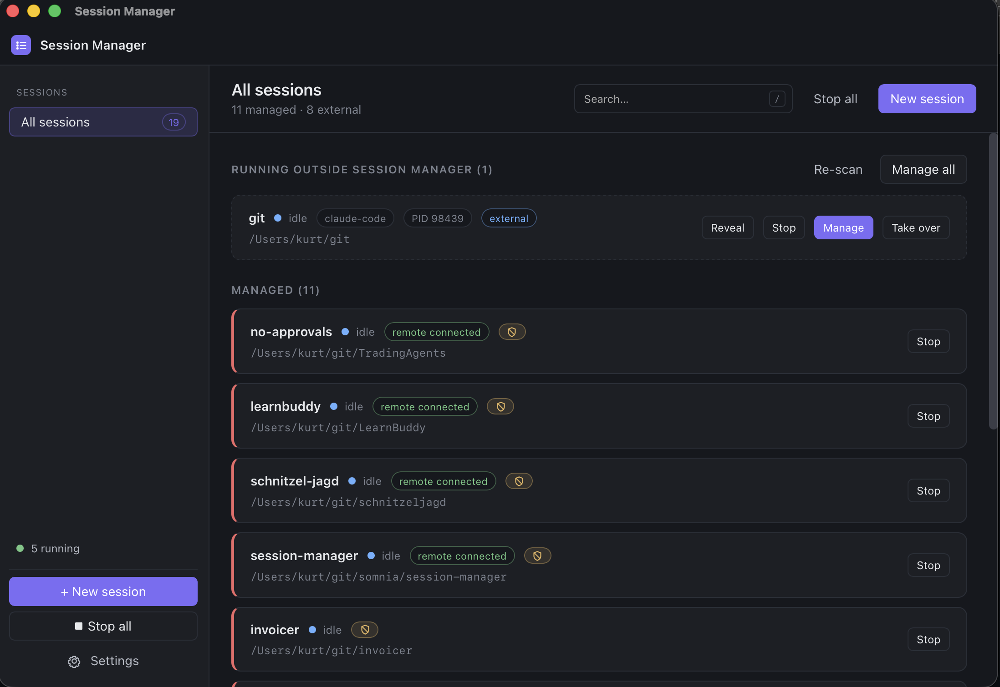

# Session Manager

[](https://github.com/0xKurt/session-manager/releases/latest)
[](https://github.com/0xKurt/session-manager/releases)
[](LICENSE)

A small, local desktop app that supervises multiple AI coding-agent sessions
(Claude Code) on your own machine. Built for myself to stop manually
restarting a dozen sessions after every reboot.

## Install (macOS, Apple Silicon)

```bash
curl -fsSL https://raw.githubusercontent.com/0xKurt/session-manager/main/scripts/install.sh | bash
```

Fetches the latest release tarball, strips Gatekeeper's quarantine flag,
drops the bundle into `/Applications/Session Manager.app`, and launches
it. The app auto-checks for updates at startup; you can also trigger a
check manually from **Settings → About**. Updates are Ed25519-signed and
verified against the pubkey embedded in the bundle.



**Defining choice:** supervisor, not a relay. Remote access uses each
agent's *native* remote feature. We never proxy traffic, never hold an
account, never phone home.

## Status

Pre-release. Functional on macOS; Windows + Linux have compiling stubs
in `crates/core/src/os/{windows,linux}.rs` waiting on per-OS fill-in.

## Build

```bash
# Once
rustup default stable
cd ui && npm install && cd ..

# Dev (Tauri opens the GUI; reload on save)
cargo tauri dev

# CLI binary
cargo run -p session-manager-cli -- list
```

A release bundle:

```bash
cargo tauri build --bundles app
# .app under target/release/bundle/macos/
```

### Cutting a release

`scripts/release.sh` automates: build → sign with the local Ed25519
key → upload `.app.tar.gz`, `.sig`, `latest.json` to GitHub as
`v<tauri.conf.json#version>`. Bump the version first, then:

```bash
./scripts/release.sh --notes "What changed"
```

End-users see the new version on their next "Check for updates".

## Layout

```
crates/
  core/     # backend trait, supervisor, OS layer, paths, events
  cli/      # session-manager CLI (mirrors core actions)
src-tauri/  # Tauri shell: IPC + tray + window
ui/         # React + Vite + TS frontend
scripts/    # release + install
```

## CLI

```text
session-manager list                                 # all sessions + state
session-manager start <id>                           # start a session
session-manager stop <id>                            # stop a session
session-manager stop --all                           # stop everything
session-manager restart <id>
session-manager logs <id> [-f]                       # tail per-session log
session-manager new --id trading-bot --path ~/code/tb [...]
session-manager delete <id>
session-manager path                                 # print sessions.toml path
session-manager auth                                 # backend login state
session-manager daemon                               # run supervisor headless
```

A single supervisor at a time per user: the GUI and CLI cannot both hold
the runtime lock. Either run the daemon (CLI) or the GUI.

## Config

`sessions.toml` lives at:

| OS      | Path                                              |
| ------- | ------------------------------------------------- |
| macOS   | `~/Library/Application Support/SessionManager/`   |
| Windows | `%APPDATA%\SessionManager\`                        |
| Linux   | `~/.config/session-manager/`                       |

Edit by hand — the supervisor reconciles on change.

## Distribution

`.github/workflows/release.yml` is wired up; populate the secrets it
expects (Apple cert, Windows cert, Tauri updater key) before tagging a
release. Until then, `tauri build` produces an unsigned bundle.
